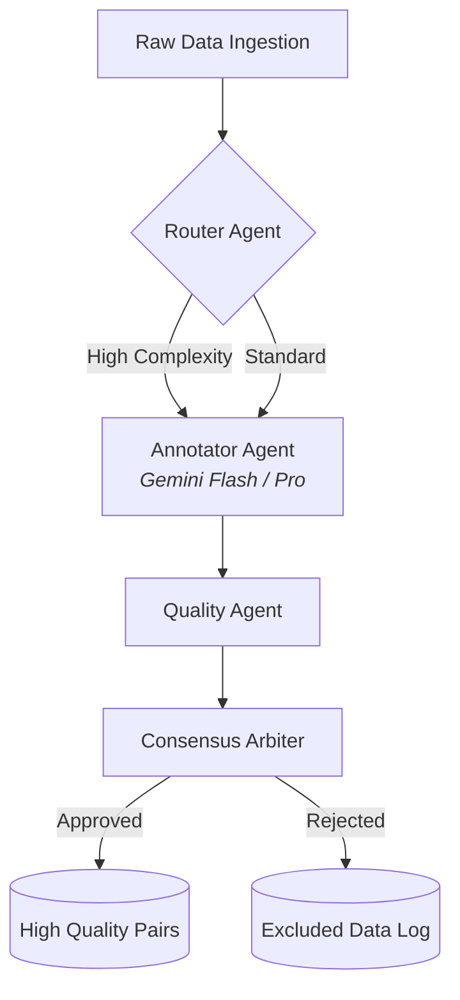

<div align="center">
  
  <a href="https://scale.com/">
    
  </a>

  <p align="center">
    <b>A highly scalable, multi-agent AI pipeline for Reinforcement Learning from Human Feedback (RLHF).</b>
  </p>

  <p align="center">
    <a href="https://github.com/tokunboajayi/ScaleAi"></a>
    <a href="https://python.org"></a>
    <a href="https://github.com/tokunboajayi/ScaleAi/actions"></a>
    <a href="LICENSE"></a>
  </p>
</div>

---

## 🚀 Overview

The **Scale AI RLHF Pipeline** employs a system of specialized AI agents, each handling a crucial step in the data refinement process. The architecture is modular, fully asynchronous, and queue-based to handle massive volumes of data efficiently—built for **Enterprise Capacity and Scale**.

### 🌟 Key Features
- **Asynchronous Execution:** Built on `asyncio` and `aiohttp` for non-blocking, high-throughput I/O.
- **Enterprise Fault Tolerance:** Implements robust exponential backoff (`tenacity`) to seamlessly handle API rate limits and `429 Quota Exceeded` errors.
- **CLI & Telemetry:** Features a full Command Line Interface (`argparse`), dynamic progress bars (`tqdm`), and centralized logging (`logging`).
- **Multi-Agent Consensus:** Uses advanced AI-driven tiebreaking alongside Cohen's Kappa scoring to ensure absolute data quality.

---

## 🧠 Architecture Overview

The pipeline executes through a sequence of autonomous agents:



1. **Ingestion Agent**: Reads the raw data, validates its schema, and batches it for processing.
2. **Router Agent**: Acts as a dispatcher, routing batched data to appropriate models.
3. **Annotator Agent**: Uses AI models to generate high-quality responses/evaluations with automatic retry handling. 
4. **Quality Agent**: Grades the annotated responses for helpfulness, harmlessness, and accuracy.
5. **Consensus Agent**: Resolves disagreements and filters out low-quality data (e.g. `LOW_QUALITY`, `AMBIGUOUS`, `SENSITIVE`).

---

## 🛠️ Setup and Installation

1. **Install Dependencies**:
   Create a virtual environment and install the enterprise requirements:
   ```bash
   python -m venv .venv
   source .venv/bin/activate  # On Windows: .venv\Scripts\activate
   
   pip install -r requirements.txt
   ```

2. **Configuration**:
   - Update `config.yaml` to tweak pipeline parameters (e.g., batch sizes, model thresholds).
   - Set up your `.env` file with necessary API keys (like `GEMINI_API_KEY`).

---

## 💻 Usage

Run the pipeline using the enterprise CLI. It features dynamic progress tracking and robust logging:

```bash
# Basic run
python main.py data/raw_pairs.jsonl

# Specify custom output directory and enable debug logging
python main.py data/raw_pairs.jsonl --output-dir custom_outputs --debug
```

### Outputs
- **`outputs/final_pairs.jsonl`**: The clean, high-quality, verified data ready for LLM training.
- **`outputs/exclude_log.jsonl`**: A detailed log of all excluded pairs and the specific reasons for rejection.
- **`pipeline.log`**: Standardized file log containing detailed execution metrics.

---
<div align="center">
  <i>Engineered for Scale AI. Built for the future of AI alignment.</i>
</div>
